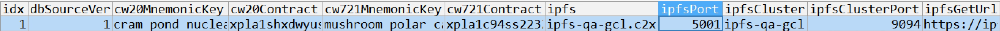

# XPLA ACADEMY Demo project Game Server code

This repository is a [BREAK THE BRICKS](https://academy.xpla.dev/playgame) game server code from XPLA ACADEMY.
Through this game, a unique wallet is created, game tokens and NFTs are issued through play, and rewards are paid to users.
Also, you can ultimately obtain testnet xpla by convert and swap in Web3 Gaming Ops.

***

1. Installation Environment
- Maria DB v15.1 or higher
- nodejs v16.14.0 or higher
- ts-node v10.9.1 or higher

2. Install node module
```
npm install
```

3. Database Configuration Settings
- db_schema\ creates and applies each sql file by DB
- system\db-config.ts Register db connection information

4. Register in the generated contract and mnemonic server_info table
   
ex) 

5. Server Start
```
npm start port(number)
```

***

## XPLA ACADEMY
[XPLA ACADEMY](https://academy.xpla.dev/) provides resources, tutorials, and educational content related to blockchain development, smart contracts, and game tokenomic systems! Master the world of XPLA step by step from XPLA ACADEMY.

***

## Web3 Gaming Ops
[Web3 Gaming Ops](https://academy.xpla.dev/ops) showcases the integrated functionalities of games and XPLA on test-net! Explore how Convert, Swap, NFT shop, and Leaderboard are linked with the sample game 'Break the Bricks.'

***

※ We created a basic logic using a timer to demonstrate the process of requesting BroadcastSync in the blockchain and receiving transaction results.
For more efficiency, consider setting up a separate daemon to confirm transaction results or implement logic that asks the client for confirmation until it's completed
