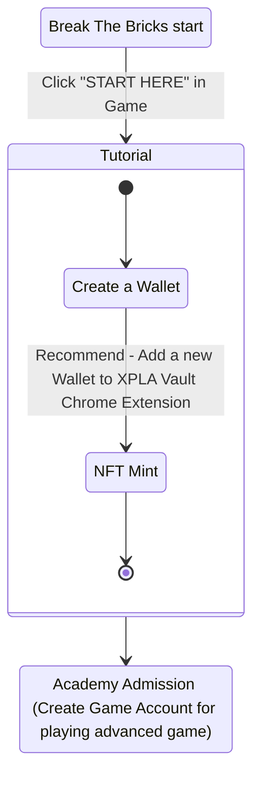
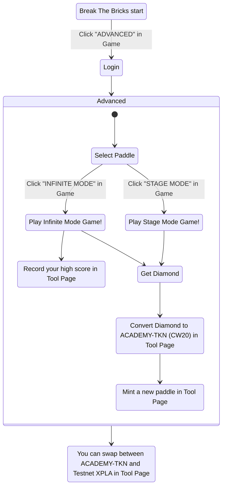

# Game Architecture

[Break The Bricks 게임](/#playgame)에는 Tutorial 과정과 Advanced 과정이 있습니다. 먼저 Tutorial 과정이 어떻게 구성되어 있는지 살펴봅시다.

Tutorial 과정을 끝내면, [Break The Bricks 게임](/#playgame)에서 사용하게 될 계정을 만들 수 있습니다.
이 계정은 Tutorial 과정에서 만든 지갑 주소와 연결되어 데이터베이스에 저장됩니다.

게임 계정을 만들면, [Break The Bricks 게임](/#playgame) Advanced 과정을 즐길 수 있습니다. Advanced 과정이 어떻게 구성되어 있는지 살펴봅시다.

[Break The Bricks 게임](/#playgame) Advanced 과정을 통해 Diamond 재화를 얻을 수 있습니다. 
[Tool Page](/tool)에서는 Diamond 재화를 CW20 토큰인 ACADEMTY-TKN으로 교환할 수도 있고, ACADEMY-TKN과 Testnet XPLA를 Swap할 수도 있습니다.

Tool Page의 Convert와 Swap 등 여러 기능을 통해 게임과 블록체인을 연결해주었습니다. 여러분도 XPLA Academy를 참고하여 직접 만든 게임과 XPLA 블록체인을 연결해보세요!