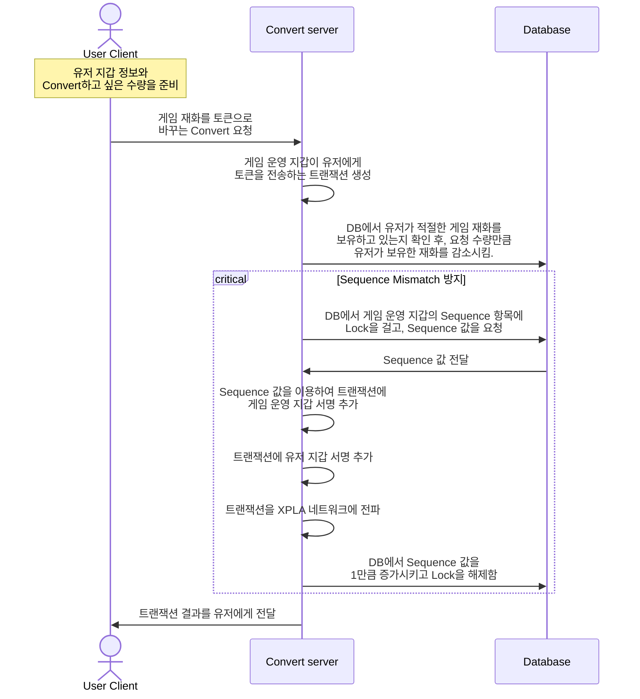

# Convert 기능 적용하기

유저는 게임 보상으로 게임에서 사용하는 재화를 받습니다. 그런데 게임 재화를 받을 때마다 트랜잭션을 발생시킨다면 어떻게 될까요? 트랜잭션을 생성할 때마다 수수료가 발생하여 유저에게 부담이 될 수 있습니다.

유저는 게임 플레이 보상으로 게임에서 사용하는 재화를 받습니다. 그런데 게임 재화를 받을 때마다 트랜잭션을 발생시킨다면 어떻게 될까요? 트랜잭션을 생성할 때마다 수수료가 발생하여 유저에게 부담이 될 수 있습니다.

따라서 **유저가 원할 때만 게임 재화를 블록체인 토큰으로 바꿀 수 있도록 도와주는 것**이 P2E 게임 운영 방식 중 하나입니다. 우리는 이러한 방식을 **Convert**라고 부릅니다. 이번 단계에서는 **Convert** 기능을 구현하는 방식에 대해 살펴보겠습니다.

:::danger

예제는 단순히 Web3 구현 방법 중 한 가지일 뿐이며, 하나의 정형화된 방법이 아닙니다. 예제 코드와 api, 데이터베이스 설계 등은 제작하는 사람에 따라, 혹은 게임 종류에 따라 달라질 수 있습니다. 따라서 예제 코드를 참고하여, 여러분의 기호대로 수정하시기 바랍니다.

:::

유저가 Convert를 요청하는 경우는 두 가지입니다. 

1. 게임 재화를 게임 토큰(CW20)로 바꾸려는 경우

2. 게임 토큰(CW20)을 게임 재화로 바꾸려는 경우

게임 재화는 게임 서버를 위한 데이터베이스에 기록이 될 것입니다. 둘의 차이는 1은 게임 서버가 유저에게 토큰을 보내주는 트랜잭션을 만들어야 한다는점이고, 2는 유저가 게임서버에 토큰을 보내야한다는 점입니다.

게임 토큰은 여러분이 게임 토큰을 발행할 때 초기 잔액으로 전달했던 지갑입니다.

아래 구조로 파악할 수 있습니다. 그러나 지금은 이 구조를 바로 이해하려고 노력하지 않아도 됩니다. 아래에서 하나하나씩 코드로 살펴보겠습니다. 

이번 단계에서 가장 중요한 점은 sequence mismatch 해결을 위한 노력과 서명을 두번 진행함으로써 전송은 게임 운영 지갑이, 수수료는 유저가 내도록 설정하는 방법을 알아볼 것입니다.

LB에 대한 경고도 말씀드려야겠습니다.

npm install @xpla/xpla.js 랑 express 설치도 진행하셔야 합니다.

