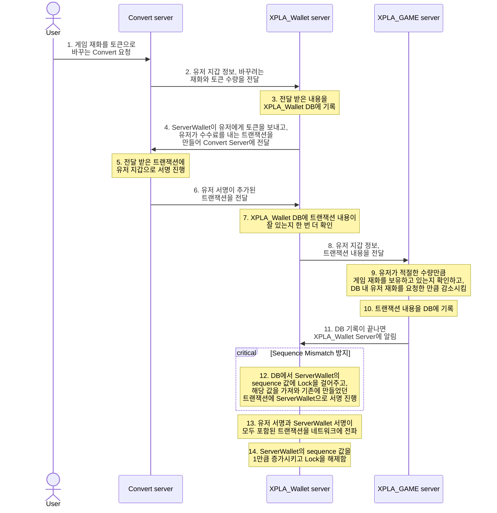

# Convert 기능 적용하기

유저는 게임 보상으로 게임에서 사용하는 재화를 받습니다. 그런데 게임 재화를 받을 때마다 트랜잭션을 발생시킨다면 어떻게 될까요? 트랜잭션을 생성할 때마다 수수료가 발생하여 유저에게 부담이 될 수 있습니다.

따라서 **유저가 원할 때만 게임 재화를 블록체인 토큰으로 바꿀 수 있도록 도와주는 것**이 P2E 게임 운영 방식 중 하나입니다. 우리는 이러한 방식을 **Convert**라고 부릅니다. 이번 단계에서는 **Convert** 기능을 구현하는 방식에 대해 살펴보겠습니다.

:::danger

예제는 단순히 Web3 구현 방법 중 한 가지일 뿐이며, 하나의 정형화된 방법이 아닙니다. 예제 코드와 api, 데이터베이스 설계 등은 제작하는 사람에 따라, 혹은 게임 종류에 따라 달라질 수 있습니다. 따라서 예제 코드를 참고하여, 여러분의 기호대로 수정하시기 바랍니다.

:::

