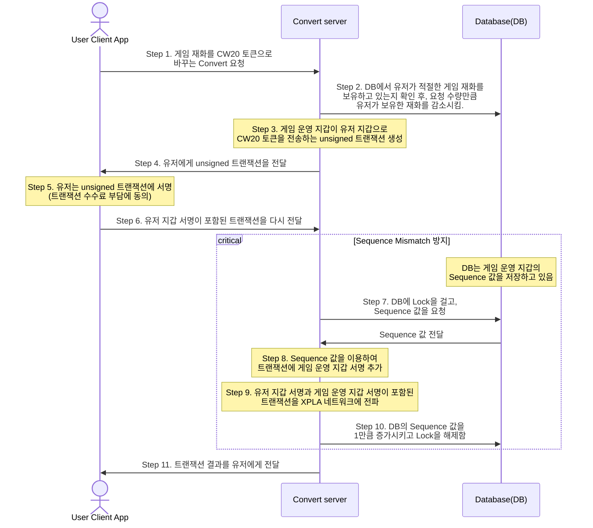
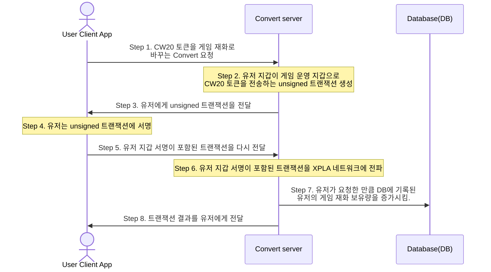

import Details from '@theme/Details';

# Convert 기능 이해하기

## Convert란 무엇인가요? {#what-is-convert}

[Break The Bricks 게임](/#playgame)을 해보셨나요? 게임 플레이를 통해 게임 재화인 DIAMOND()를 획득할 수 있습니다. 
그러나 DIAMOND()는 CW20 토큰이 아닌 단순 게임 데이터에 불과하고, 블록체인에서 사용할 수 없습니다.
[Web3 Gaming Ops. 페이지](/ops)에서 제공하는 Convert 기능을 통해, 유저들은 DIAMOND()를 CW20 토큰인 ACADEMY-TKN()으로 교환할 수 있습니다.

Convert 과정은 왜 필요할까요? 
게임 플레이 보상으로 매번 CW20 토큰인 ACADEMY-TKN()을 나눠준다면, 항상 트랜잭션 실행을 위해 수수료가 발생하게 됩니다.
수수료 부담을 줄이기 위해 게임 플레이 보상으로 게임 재화인 DIAMOND()를 전달하고, <b>유저가 원할 때 게임 재화()와 CW20 토큰()을 교환</b>하는 **Convert** 방식을 도입했습니다.
이번 단계에서는 Convert 기능을 어떻게 구현하는지 살펴보겠습니다.

<Details summary="게임 재화와 CW20 토큰은 무엇이 다른가요?">

유저는 게임을 즐기면서 보상으로 게임 재화를 얻습니다. 
[Break The Bricks](/#playgame)의 경우, 게임을 통해 DIAMOND()를 획득할 수 있습니다. 
게임 재화는 게임 제작사의 데이터베이스에 저장되어 있어, 블록체인 네트워크에서 사용할 수 없습니다.

그러나 CW20 토큰은 블록체인에 기록되어 있기 때문에 블록체인 네트워크에서 사용할 수 있습니다.
[Break The Bricks](/#playgame)에서 유저는 Convert 과정을 통해 CW20 토큰인 ACADEMY-TKN()을 얻을 수 있습니다.

</Details>

## Convert 과정 살펴보기 {#convert-process}

유저가 Convert를 요청하는 경우는 두 가지입니다. 

[1. 게임 재화()를 CW20 토큰()으로 바꾸려는 경우](/docs/tutorial/deep-understand-xpla/convert#convert-case1)

[2. CW20 토큰()을 게임 재화()로 바꾸려는 경우](/docs/tutorial/deep-understand-xpla/convert#convert-case2)

### 1. 게임 재화를 CW20 토큰으로 바꾸려는 경우 {#convert-case1}

먼저 1번 과정을 자세히 살펴보겠습니다.
유저가 보유한 게임 재화()의 양은, 게임을 운영하는 측의 데이터베이스에 기록되어 있습니다. 
반면, CW20 토큰()의 보유량은 XPLA 블록체인에 기록되어 있습니다.
따라서 게임 재화()를 CW20 토큰()으로 바꾸려면, 데이터베이스에 기록된 유저의 게임 재화() 보유량을 감소시키고, 유저 지갑으로 CW20 토큰()을 보내주어야 합니다.

일반적으로 블록체인에서 토큰을 보낼 때는 보내는 지갑이 트랜잭션 수수료를 감당합니다. 그러나 Convert에서는 토큰을 받는 유저가 수수료를 냅니다.
만약 게임을 운영하는 측이 Convert 수수료를 모두 부담한다면, Convert하려는 유저가 많아질수록 수수료 지출이 커져 게임 운영이 어려워지기 때문입니다.
그러므로 Convert 트랜잭션은 <u>CW20 토큰을 보내는 게임 운영 지갑의 서명</u>이 필요하고, <u>트랜잭션 수수료를 지불하기 위해 토큰을 받는 유저 지갑의 서명</u> 모두가 필요합니다.

1번 과정 전체 구조를 그림으로 그려보면 아래와 같습니다. 복잡해보이지만, 하나하나씩 살펴보면 어렵지 않습니다.


<br/>

:::danger

예제는 단순히 Convert 기능의 구현 방법 중 한 가지일 뿐이며, 예외 처리 등 생략된 부분도 많습니다. 하나의 정형화된 방법이 있는 것이 아니며, API나 데이터베이스 설계 등은 게임 종류에 따라 달라질 수 있습니다. 따라서 예제 코드를 참고하여, 여러분의 기호대로 수정하시기 바랍니다.

:::


위 구조도에서 Sequence mismatch를 방지하기 위해 데이터베이스(DB)에 Lock을 거는 부분이 중요합니다. 
다수의 유저들이 동시에 Convert 요청을 보내는 상황을 가정해봅시다. 
모든 요청을 빠르게 처리하기 위해, 게임 운영 지갑도 Convert 트랜잭션 여러 개를 한번에 생성하려 한다면 어떻게 될까요? 
Sequence가 중복된 트랜잭션은 블록체인에 기록될 수 없기 때문에, Sequence Mismatch Error가 발생하고 트랜잭션 생성이 원활히 되지 않을 것입니다.
따라서 요청 순서대로 Sequence 값을 다르게 작성하여 트랜잭션을 생성해야 합니다.

특히 게임 서버 운영을 위해 Load Balancer를 사용하신다면, Sequence mismatch Error가 일어나지 않도록 주의하셔야 합니다.
Sequence mismatch 개념을 모르시거나 관련 내용이 잘 이해가 되지 않으신다면, [트랜잭션에서 AccountNumber와 Sequence 항목 이해하기](/docs/tutorial/deep-understand-xpla/account-sequence) 단계를 읽고 오시기 바랍니다.

각 과정이 어떻게 구현되는지 아래 Pseudo 코드로 알아봅시다. (Pseudo 코드이기 때문에 코드 그대로 실행은 되지 않습니다.)

Step 1. User Client App -> Convert Server : 게임 재화를 CW20 토큰으로 바꾸는 Convert 요청 

```js {6} title="User Client App"
import { useWallet } from "@xpla/wallet-provider";

const { wallets } = useWallet();
const userAddress = wallets[0].xplaAddress;

const unsignedResponse = await axios.post(
    "https://convertserver.com/gamecurrency-to-coin-unsigned", 
    {
        userAddress: userAddress, 
        amount : 1,
    }
); 
```

유저가 게임 재화를 CW20 토큰으로 교환하려고 합니다. 유저 클라이언트 앱은 유저 지갑 주소(userAddress)와 Convert하려는 게임 재화량(amount)을 담아, Convert Server에 Post 요청을 보냅니다.

<br/>

Step 2. Convert Server -> Database(DB) : DB에서 유저가 적절한 게임 재화를 보유하고 있는지 확인 후, 요청 수량만큼 유저가 보유한 재화를 감소시킴.

```js title="Convert Server"
db.query('update user_info set game_currency = game_currency - ? where pid = ? ', [req.body.amount, playerId]);
```

Convert하려는 수량(amount)보다 많이 있을 때, 유저가 보유한 재화량을 감소시킵니다. 

<br/>

Step 3. Convert Server : 게임 운영 지갑이 유저 지갑으로 CW20 토큰을 전송하는 unsigned 트랜잭션 생성

```js {6,17,29,31} title="Convert Server"
import { LCDClient, MsgExecuteContract, TxAPI, Fee } from "@xpla/xpla.js"

const lcd = new LCDClient({	chainID, URL });
const tx_api = new TxAPI(lcd);

const cw20TransferMsg = new MsgExecuteContract(
        game_operator_address,
        cw20_contract_address, 
        {
            transfer: {
                recipient : req.body.userAddress,
                amount: String(req.body.amount)
            }
        }
    )

const simul_fee = await tx_api.estimateFee(
    [        
    { 
        sequenceNumber: game_operator_address_sequence, 
        publicKey: game_operator_address_pubKey 
    }
    ],
    {
    msgs: [cw20TransferMsg],
    gasAdjustment: 1.5,			
    }
);
const fee = new Fee(simul_fee.gas_limit, simul_fee.amount.toString(), req.body.userAddress); // gas_limit, amount, payer

const tx = await lcd.tx.create([], {msgs: [cw20TransferMsg], fee }) // signers, options
```

트랜잭션 예상 수수료(simul_fee)를 계산하고, 게임 운영 지갑(game_operator_address)이 유저 지갑(userAddress)으로 CW20 토큰을 전송하는 트랜잭션을 생성합니다. 
이때 fee 변수를 초기화할 때, payer parameter로 userAddress 변수를 전달하여 유저 지갑이 수수료 지불자가 되도록 설정합니다.

<br/>

Step 4. Convert Server -> User Client App: 유저에게 unsigned 트랜잭션을 전달

```js title="Convert Server"
const unsignedTx = Buffer.from(tx.toBytes()).toString('base64')
const result = { unsignedTx : unsignedTx }
return result
```

User Client의 Post 요청에 대한 응답으로, unsigned 트랜잭션을 전달합니다.
    
<br/>

Step 5. User Client App : 유저는 unsigned 트랜잭션에 서명(트랜잭션 수수료 부담에 동의)

```js {9,12} title="User Client App"
const unsignedResponse = await axios.post(unsignedUrl, unsignedPost);
const unsignedTx = unsignedResponse.data.unsignedTx;

if (unsignedTx === undefined) {
    throw new Error("Response is undefined!");
}
const decodedTx = Tx.fromBuffer(Buffer.from(unsignedTx, "base64"));

const { result: signedTx, success } = await connectedWallet.sign({
    msgs: decodedTx.body.messages,
    fee: decodedTx.auth_info.fee,
    signMode: SignMode.SIGN_MODE_LEGACY_AMINO_JSON,
});
```

유저 클라이언트는 Convert Server 응답(unsignedResponse)으로 받은 unsigned 트랜잭션에 서명을 진행합니다. 
[1번 과정](/docs/tutorial/deep-understand-xpla/convert#convert-case1)의 Convert 트랜잭션은 유저 지갑 서명과 게임 운영 지갑 서명이 필요한 [다중 서명](https://docs.cosmos.network/main/user/run-node/txs#signing-with-multiple-signers)이기 때문에, **SignMode.SIGN_MODE_LEGACY_AMINO_JSON** 변수로 서명하는 것이 중요합니다. 

<br/>

Step 6. User Client App -> Convert Server : 유저 지갑 서명이 포함된 트랜잭션을 다시 전달

```js {3,6,7} title="User Client App"
const userSignedTx = Buffer.from(signedTx.toBytes()).toString("base64");

const res = await axios.post(
    "https://convertserver.com/gamecurrency-to-coin-signed", 
    {
        wallet: userAddress,
        userSignedTx: userSignedTx,
    }
);
```

유저 클라이언트가 유저 지갑 주소(userAddress)와 유저 지갑 서명을 추가한 트랜잭션 정보(userSignedTx)를 담아, Convert Server에 Post 요청을 보냅니다. 

<br/>

Step 7. Convert Server -> Database(DB) : DB에 Lock을 걸고, Sequence 값을 요청

```js {6,9} title="Convert Server"
const game_opeartor_mk = new MnemonicKey({ mnemonic: opeartorMnemonicKey })
const operatorWallet = lcd.wallet(game_opeartor_mk);
const operatorState = await operatorWallet.accountNumberAndSequence()
const operatorAccNum = operatorState.account_number   

await db.beginTransaction()
let txResult; 
try {
    const [data, ] = await db.query('SELECT sequence FROM operator_sequence WHERE accAddress = ? FOR UPDATE', [operatorWallet.key.accAddress]);
    const operatorSeq = data[0].sequence
```

예제에서는 beginTransaction 함수를 이용하여 DB에 Lock을 걸고, 쿼리를 통해 게임 운영 지갑의 Sequence 값을 전달받습니다.

<br/>

Step 8. Convert Server : Sequence 값을 이용하여 트랜잭션에 게임 운영 지갑 서명 추가

```js {9,12} title="Convert Server"
try { // step 7
    const [data, ] = await db.query('SELECT sequence FROM operator_sequence WHERE accAddress = ? FOR UPDATE', [operatorWallet.key.accAddress]); // step 7
    const operatorSeq = data[0].sequence // step 7

    const signOption: SignOptions = {
    chainID: chainID,
    accountNumber: operatorAccNum,
    sequence: operatorSeq,
    signMode: SignMode.SIGN_MODE_LEGACY_AMINO_JSON
    }
    
    const tx = Tx.fromBuffer(Buffer.from(String(req.body.userSignedTx), 'base64'))
    const allSignedTx = await operatorWallet.key.signTx(tx, signOption, false)
    allSignedTx.signatures.reverse()
    allSignedTx.auth_info.signer_infos.reverse()
    ...
```

DB에서 전달받은 Sequence 값으로 트랜잭션에 게임 운영 지갑 서명을 추가합니다. 
이때도 **SignMode.SIGN_MODE_LEGACY_AMINO_JSON** 변수로 서명해주어야 합니다.

<Details summary="마지막 부분에서 signatures와 signer_infos의 reverse() 함수를 사용하는 이유는 무엇인가요?">

지금까지 트랜잭션 수수료 지불을 위해 유저 지갑의 서명을 먼저 받고, CW20 토큰 전달의 주체인 게임 운영 지갑의 서명을 나중에 받았습니다.
현재 트랜잭션(allSignedTx 변수) 내 서명 순서가 유저 지갑 - 게임 운영 지갑 순입니다.

CW20 토큰을 전달하는 트랜잭션 Execute에 필요한 서명은 게임 운영 지갑의 서명이고, 유저의 서명은 수수료 지불을 위해 추가된 것입니다.
만약 유저가 트랜잭션 수수료를 내지 않았다면, CW20 토큰을 Transfer하는 게임 운영 지갑의 서명만 있었으면 됩니다.

[Cosmos SDK에서 수수료 지불자(Fee payer)가 추가되어도, 트랜잭션 서명 순서가 바뀌지는 않습니다.](https://github.com/xpladev/xpla/blob/aa5c2e3cac00c2286f3ce4ba2526df6cddc3f550/third_party/proto/cosmos/tx/v1beta1/tx.proto#L174C1-L176C96)
따라서 올바른 트랜잭션 서명 순서는 게임 운영 지갑 - 유저 지갑 순입니다.
예제에서는 reverse 함수를 이용하여 서명 순서를 조정하였고, 트랜잭션 생성이 잘 되는 것을 확인할 수 있습니다.

</Details>

<br/>

Step 9. Convert Server : 유저 지갑 서명과 게임 운영 지갑 서명이 포함된 트랜잭션을 XPLA 네트워크에 전파

```js title="Convert Server"
txResult = await lcd.tx.broadcastSync(allSignedTx)      
```

트랜잭션을 XPLA 네트워크에 전파합니다.

<br/>

Step 10. Convert Server -> Database(DB) : DB의 Sequence 값을 1만큼 증가시키고 Lock을 해제함

```js title="Convert Server"
    await db.execute(`UPDATE operator_sequence SET sequence = ? WHERE accAddress = ?`, [operatorSeq+1, operatorWallet.key.accAddress])

    await db.commit(); 
    db.release();
```

트랜잭션 생성이 제대로 이루어지면, DB 내 저장된 게임 운영 지갑의 Sequence 값을 수정하고, DB에 걸려 있는 Lock을 해제합니다.

<br/>

Step 11. Convert Server -> User Client App : 트랜잭션 결과를 유저에게 전달

```js title="Convert Server"
return { txhash : txResult.txhash }
```

User Client의 Post 요청에 대한 응답으로, 트랜잭션 전파 결과를 전달합니다.

<br/>


### 2. CW20 토큰을 게임 재화로 바꾸려는 경우 {#convert-case2}

2번 과정은 1번 과정보다 간단합니다. CW20 토큰()을 게임 재화()로 바꾸려면, 유저 지갑이 게임 운영 지갑으로 CW20 토큰()을 보내주고, 데이터베이스에 기록된 유저의 게임 재화() 보유량을 증가시키면 됩니다. 
2번 과정을 구조도로 그리면 아래와 같습니다.


<br/>

유저 지갑은 CW20 토큰()을 보내면서, 트랜잭션 수수료도 지불합니다.
따라서 유저 지갑 서명만 있으면 Convert 트랜잭션 생성이 가능합니다.
또한, 게임 운영 지갑이 서명할 필요가 없으므로, Sequence mismatch Error를 걱정하지 않아도 됩니다.

각 과정이 어떻게 구현되는지 아래 Pseudo 코드로 알아봅시다. (Pseudo 코드이기 때문에 코드 그대로 실행은 되지 않습니다.)

Step 1. User Client App -> Convert Server : CW20 토큰을 게임 재화로 바꾸는 Convert 요청 

```js {6} title="User Client App"
import { useWallet } from "@xpla/wallet-provider";

const { wallets } = useWallet();
const userAddress = wallets[0].xplaAddress;

const unsignedResponse = await axios.post(
    "https://convertserver.com/coin-to-gamecurrency-unsigned", 
    {
        userAddress: userAddress, 
        amount : 1,
    }
); 
```

유저가 CW20 토큰을 게임 재화로 교환하려고 합니다. 유저 클라이언트 앱은 유저 지갑 주소(userAddress)와 받고 싶은 게임 재화량(amount)을 담아, Convert Server에 Post 요청을 보냅니다.

<br/>

Step 2. Convert Server : 유저 지갑이 게임 운영 지갑으로 CW20 토큰을 전송하는 unsigned 트랜잭션 생성

```js {7,18,31,33} title="Convert Server"
import { LCDClient, MsgExecuteContract, TxAPI, Fee } from "@xpla/xpla.js"

const lcd = new LCDClient({ chainID, URL });
const tx_api = new TxAPI(lcd);
const userAccountInfo = await lcd.auth.accountInfo(req.body.userAddress);

const cw20TransferMsg = new MsgExecuteContract(
    req.body.userAddress,
    cw20_contract_address, 
    {
        transfer: {
            recipient : game_operator_address,
            amount: String(req.body.amount)
        }
    }
)

const simul_fee = await tx_api.estimateFee(
    [        
        { 
            sequenceNumber: userAccountInfo.getSequenceNumber(), 
            publicKey: userAccountInfo.getPublicKey()
        }
    ],
    {
        msgs: [cw20TransferMsg],
        gasAdjustment: 1.5,         
    }
);

const fee = new Fee(simul_fee.gas_limit, simul_fee.amount.toString());

const tx = await lcd.tx.create([], {msgs: [cw20TransferMsg], fee } )
```

트랜잭션 예상 수수료(simul_fee)를 계산하고, 유저 지갑(userAddress)이 게임 운영 지갑(game_operator_address)으로 CW20 토큰을 전송하는 트랜잭션을 생성합니다. 
이번에는 fee 변수를 초기화할 때, payer parameter에 아무 값도 입력하지 않습니다.

<br/>

Step 3. Convert Server -> User Client App: 유저에게 unsigned 트랜잭션을 전달

```js title="Convert Server"
const unsignedTx = Buffer.from(tx.toBytes()).toString('base64')
const result = { unsignedTx : unsignedTx }
return result
```

User Client의 Post 요청에 대한 응답으로, unsigned 트랜잭션을 전달합니다.

<br/>

Step 4. User Client App : 유저는 unsigned 트랜잭션에 서명

```js {9,12} title="User Client App"
const unsignedResponse = await axios.post(unsignedUrl, unsignedPost);
const unsignedTx = unsignedResponse.data.unsignedTx;

if (unsignedTx === undefined) {
    throw new Error("Response is undefined!");
}
const decodedTx = Tx.fromBuffer(Buffer.from(unsignedTx, "base64"));

const { result: signedTx, success } = await connectedWallet.sign({
    msgs: decodedTx.body.messages,
    fee: decodedTx.auth_info.fee,
    signMode: SignMode.SIGN_MODE_DIRECT,
});
```

유저 클라이언트는 Convert Server 응답(unsignedResponse)으로 받은 unsigned 트랜잭션에 서명을 진행합니다. 
[2번 과정](/docs/tutorial/deep-understand-xpla/convert#convert-case2)의 Convert 트랜잭션은 유저 지갑 서명만 필요한 [단일 서명](https://docs.cosmos.network/main/user/run-node/txs#signing-with-multiple-signers)이기 때문에, **SignMode.SIGN_MODE_DIRECT** 변수로 진행합니다. 

<br/>

Step 5. User Client App -> Convert Server : 유저 지갑 서명이 포함된 트랜잭션을 다시 전달

```js {3,6,7} title="User Client App"
const userSignedTx = Buffer.from(signedTx.toBytes()).toString("base64");

const res = await axios.post(
    "https://convertserver.com/coin-to-gamecurrency-signed", 
    {
        wallet: userAddress,
        userSignedTx: userSignedTx,
    }
);
```

유저 클라이언트가 유저 지갑 주소(userAddress)와 유저 지갑 서명을 추가한 트랜잭션 정보(userSignedTx)를 담아, Convert Server에 Post 요청을 보냅니다. 

<br/>

Step 6. Convert Server : 유저 지갑 서명이 포함된 트랜잭션을 XPLA 네트워크에 전파

```js title="Convert Server"
const tx = Tx.fromBuffer(Buffer.from(String(req.body.userSignedTx), 'base64'))

txResult = await lcd.tx.broadcastSync(allSignedTx)      
```

트랜잭션을 XPLA 네트워크에 전파합니다.

<br/>

Step 7. Convert Server -> Database(DB) : 유저가 요청한 만큼 DB에 기록된 유저의 게임 재화 보유량을 증가시킴.

```js title="Convert Server"
db.query('update user_info set game_currency = game_currency + ? where pid = ? ', [req.body.amount, playerId]);
```

유저가 받고 싶은 게임 재화량(req.body.amount)만큼 증가시킵니다.

<br/>

Step 8. Convert Server -> User Client App : 트랜잭션 결과를 유저에게 전달

```js title="Convert Server"
return { txhash : txResult.txhash }
```

User Client의 Post 요청에 대한 응답으로, 트랜잭션 전파 결과를 전달합니다.

<br/>

## 마무리

지금까지 Convert 기능 구현에 대해 자세히 살펴보았습니다. Convert 기능을 통해 유저들은 게임 DB의 게임 재화와 블록체인 네트워크의 CW20 토큰을 교환할 수 있습니다. 게임과 블록체인을 연결해주는 Convert 기능을 여러분의 게임에 적용해보세요.

<!--
## Prerequisite

Chrome Extension Vault가 1.2.0 이상이어야 합니다.

npm install @xpla/xpla.js 랑 express 설치도 진행하셔야 합니다. 

중간중간에 api 요청이 실패했거나, 네트워크 오류로 인한 트랜잭션 생성이 실패했을 때 오류 처리는 생략하겠습니다.
-->